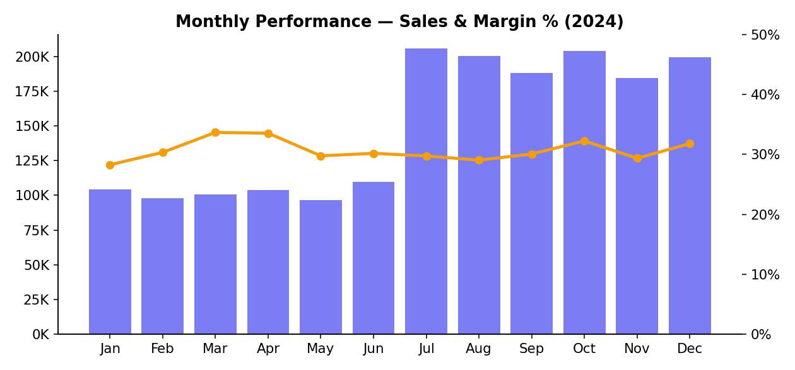
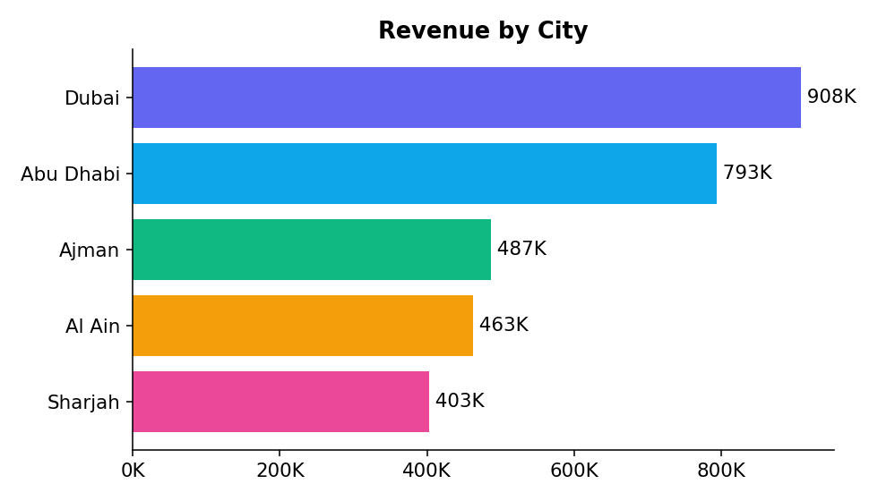
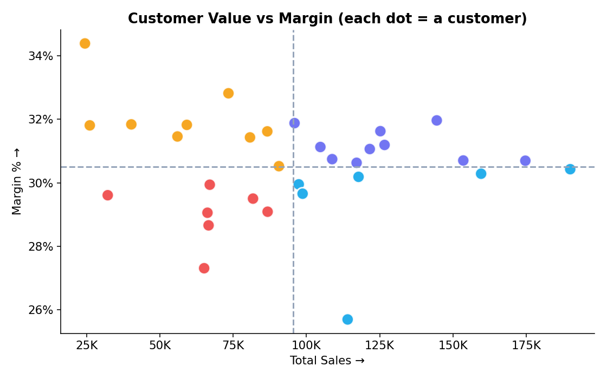
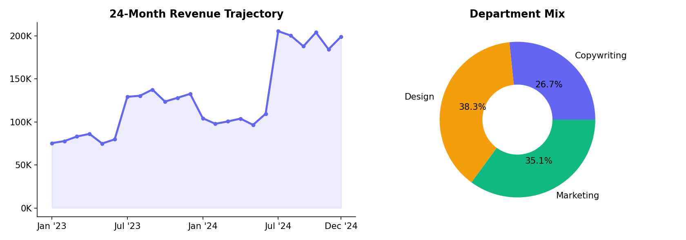

# UAE Market Sales Analytics Dashboard (Streamlit + Plotly)

An interactive **Streamlit** analytics dashboard for a UAE digital-services agency, built with **pandas** and **Plotly**. It analyzes **AED 3.05M** in sales across **2023–2024**, **5 emirates**, and **32 customers** — organized into four purpose-built tabs (Overview, Customers, Breakdown, Story) that move from headline KPIs all the way to a narrative business case.



---

## Business Questions

This dashboard was built to answer the questions an agency's leadership actually asks:

- **How is revenue and margin trending?** What are sales, cost, margin, and margin % month-by-month, and how does 2024 compare to 2023?
- **Which markets and services pay off?** How do revenue and margin break down by city, department, service, package, and sale type?
- **Who are our best customers?** Which clients drive revenue, who is high-value *and* high-margin, and who is underperforming?
- **How loyal is the book of business?** What share of revenue comes from repeat vs new sales?
- **What's the one-screen story?** Can the numbers be turned into a clear growth narrative for stakeholders?

---

## Headline Metrics

| Metric | Value |
|---|---|
| Total Sales | AED 3.05M |
| Total Margin | AED 931K |
| Margin % | 30.5% |
| 2023 → 2024 Growth | +42.5% |
| Records | 480 |
| Customers | 32 |
| Cities | 5 |
| Services / Departments | 5 / 3 |

*(Figures reflect the full dataset; the live app recomputes everything for any filter selection.)*

---

## The Four Tabs

### 📈 Overview
Five reactive KPI cards (Sales, Cost, Margin, Margin %, Orders), a monthly combo chart with a switchable bar metric and an optional **2023-vs-2024 comparison**, a sales-by-city ranking, and a dynamic **breakdown explorer** that re-groups the data by any dimension on demand.



### 👥 Customers
Customer intelligence with cascading filters (type, source, sale type, name search), a ranked **leaderboard**, and a **value-vs-margin quadrant** scatter that classifies every client into stars, high-margin, high-value, and underperformers against the portfolio averages.



### 🧩 Breakdown
Portfolio composition: department mix and sale-type donuts, plus sales-by-service and sales-by-package bars.

### 📖 Story
An auto-generated **narrative** — headline growth figure, top market, best-margin department, top customer, loyalty and seasonality call-outs — followed by a 24-month revenue trajectory and service-mix and top-5-customer charts.



---

## Key Findings

- **AED 3.05M in sales at a 30.5% margin**, with strong **+42.5% year-over-year growth** (AED 1.26M → 1.79M).
- **Dubai leads** (~AED 908K), followed by Abu Dhabi; the five emirates are reasonably balanced.
- **H2 outperforms H1 every year**, with a July peak — a clear seasonal pattern.
- **Repeat sales make up a large share of revenue**, signaling healthy client retention.
- **SEO and Ads services sit near 25% margin**, below the portfolio average — a margin-improvement opportunity.

---

## Tech Stack & Implementation

- **Streamlit** — tabbed layout, sidebar global filters, reactive KPI cards, CSV export of the filtered view, and per-chart keys for stable reruns.
- **Plotly (Graph Objects + Express)** — dual-axis combo charts, donuts, horizontal bars, a quadrant scatter with reference lines, and a filled trajectory; a shared `PLOTLY_CONFIG` keeps zoom/pan/hover enabled everywhere.
- **pandas** — a single `summarize()` helper powers every grouping (sales, margin amount, orders, margin %); `margin_amt` is precomputed at load; months are made a calendar-ordered `Categorical` so they never sort alphabetically.
- **Theme-aware styling** — a `style_fig()` helper resolves text color from the active Streamlit theme so labels stay legible in light or dark mode.
- **`@st.cache_data`** on the loader for fast reruns.

See [`docs/DATA_DICTIONARY.md`](docs/DATA_DICTIONARY.md) for the full field reference and derived-metric definitions.

## 📄 Project Report

A polished, 7-page business-intelligence report accompanies this dashboard, covering the executive summary, growth and seasonality, profitability by department and service, geographic performance, customer intelligence, and recommendations:

**[docs/UAE_Market_Sales_Analytics_Report.pdf](docs/UAE_Market_Sales_Analytics_Report.pdf)**

---

## Skills Demonstrated

- Designing a **multi-tab analytical product** with a deliberate flow from KPIs → segments → customers → narrative.
- **Customer segmentation** via a value/margin quadrant model with data-driven thresholds.
- **Reusable, well-documented code** — small focused helpers (`summarize`, `style_fig`, `fmt_k`) instead of copy-pasted chart logic.
- **YoY / seasonality analysis** and auto-generated written insights from live aggregates.
- Production touches: cached loading, filtered-data export, theme-aware charts, and relative data paths.

---

## Repository Structure

```
.
├── app.py                      # Streamlit application
├── data/
│   └── UAE_sales_data.csv      # Source dataset (480 records)
├── docs/
│   ├── DATA_DICTIONARY.md      # Field reference & derived metrics
│   └── UAE_Market_Sales_Analytics_Report.pdf   # 7-page business report
├── images/                     # Chart previews
├── requirements.txt
└── README.md
```

---

## How to Run

```bash
# 1. Install dependencies
pip install -r requirements.txt

# 2. Launch the app
streamlit run app.py
```

The app opens at `http://localhost:8501` and loads `data/UAE_sales_data.csv` automatically.

---

*Built with Streamlit, Plotly, and pandas. Sales figures are in AED. Dataset models a UAE digital-services agency's 2023–2024 performance.*
